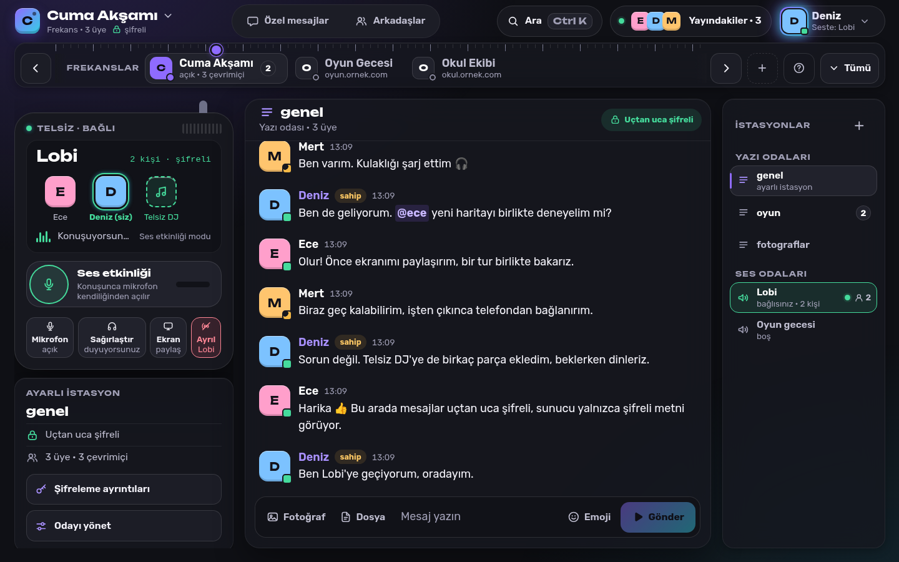
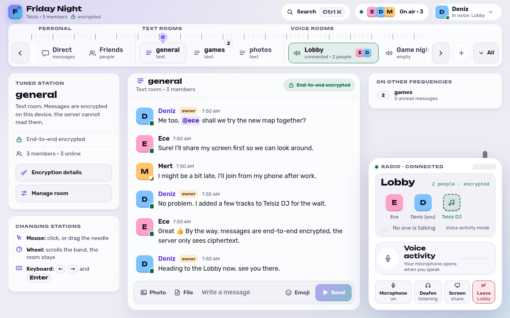
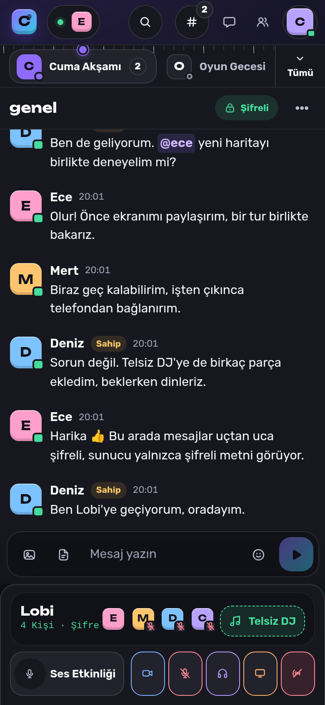
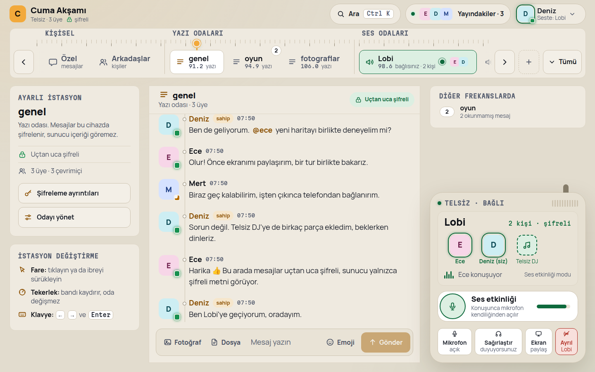
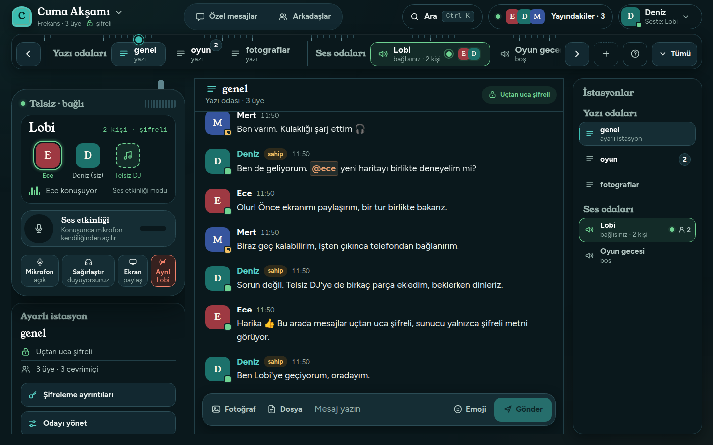
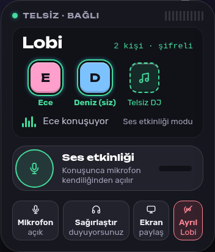
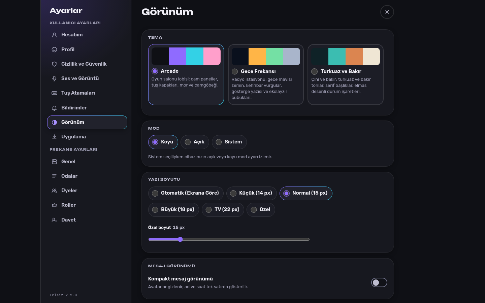

# Telsiz

[Türkçe](README.md) | [English](README.en.md)

Telsiz is an open source (MIT), self-hosted, end-to-end encrypted app for text and voice communication. The server runs on the computer of one person in the group, on a home server or on a rented server, and everyone connects with a browser. The same interface opens on Windows PCs, Macs, Linux, Android and iOS phones, tablets and game console browsers. Anyone can install Telsiz as an app or use the desktop app built for Windows and Linux.

Messages, files, profiles and the setup messages of voice connections are encrypted on the device. The server stores and relays this content only in encrypted form. The server has no runtime dependencies. It runs on Node.js 20 or newer, or as a single file build that does not need Node.js.



## Features

**Rooms and the frequency band.** Telsiz is laid out like a radio dial. Text rooms and voice rooms sit as stations on a horizontal frequency band at the top of the screen. A needle above the band shows the open conversation, and when you drag and drop the needle with a mouse or a finger it settles on the nearest station. Unread messages and mentions appear as badges on the corners of stations, and a voice room with someone speaking in it pulses. Direct messages and friends are in the Personal group on the left of the band, while your profile, status and settings are in the avatar menu at the top right.

**End-to-end encrypted messaging.** Messages, photos and files in text rooms are encrypted with the group key, and direct messages with the personal keys of the two people. Photos other than GIFs are re-encoded on the device before they are sent, which removes metadata including the location. A message can carry up to 10 files, and a file can be up to 25 MB by default. Messages can be edited and deleted, and there is an emoji picker, @ mentions and a typing indicator. In direct messages the other person's key can be verified with a safety number.

**Friends and direct messages.** Users can send each other friend requests by username, accept them and block people. Messages from a blocked person in text rooms are collapsed and their voice is muted on your side.

**Voice chat.** Audio flows directly between people over WebRTC and does not pass through the server. You choose between voice activity detection (with an automatic or manual threshold) and push to talk. A keyboard key, a mouse side button or a gamepad button can be assigned to push to talk, mute and deafen. When you join a voice room, a radio card that looks like a handheld radio opens: the people in the room, a halo around the speaker, a large Push to talk button, and buttons for the microphone, deafen, screen sharing and leaving. The volume of each person can be adjusted. Up to 8 people can join a voice room.

**Screen sharing.** Anyone in a voice room can share their screen, a window or a tab. Video is sent only to people who press Watch. The person sharing chooses between smooth motion and sharp text, a resolution of 720p or 1080p, a frame rate of 15 or 30 and, optionally, audio.

**Telsiz DJ.** Voice rooms have a built-in music bot. Typing `/play` and a YouTube link in the message box, or pressing "Play in DJ" on an audio file in a message, adds the track to the queue. Everyone hears the track at the same time on their own device. YouTube tracks load in the official YouTube embedded player, and only after the person gives consent on that device. Shared audio files play without consent. The server owner can turn off Telsiz DJ or only the YouTube source.

**Search on the device.** Message search runs entirely on the device. The server never sees the search text or the message content.

**Appearance.** There are three themes: Arcade, Night Frequency (Gece Frekansı) and Turquoise and Copper (Turkuaz ve Bakır). Each has a dark and a light mode, and the mode can follow the system setting. Avatars are soft squares in every theme. There are options for font size, a compact message view and reduced motion. The interface is in Turkish and English.

**On every device.** The interface works with a mouse, keyboard, touch screen and gamepad. At TV width (1800 pixels and up) text and the focus ring grow, and when a gamepad is detected a controller hint bar appears at the bottom. Telsiz can be installed as an app (PWA) on phones, tablets and computers.

**Installation options.** An npm package (`npx telsiz`), a single file server for Windows and Linux that does not need Node.js, a Docker image on the GitHub Container Registry, a desktop app for Windows and Linux, and start scripts in the repository.

## Screenshots

| | |
| --- | --- |
|  |  |
| English interface | Phone view |
|  |  |
| Night Frequency, light mode | Turquoise and Copper, dark mode |
|  |  |
| Radio card in a voice room | Full screen settings |

## Quick start

Whichever path you choose, the server prints a one time setup code to the console on first start. You then open the server address in a browser and create the owner account with that code (see [First run and invites](#first-run-and-invites)). The server listens on port 3000 by default, and on the computer that runs it the address is `http://localhost:3000`. The detailed installation guide is in [docs/DEPLOYMENT.md](docs/DEPLOYMENT.md).

### With npm

Node.js 20 or newer is required.

```sh
npx telsiz
```

For a permanent installation, run `npm install -g telsiz` and then the `telsiz` command. Data is written to the `veri` folder inside the folder where the command runs, so always run the command in the same folder or set a fixed folder with the `VERI_KLASORU` (`DATA_DIR`) setting.

### Single file for Windows

1. Download `telsiz-<version>-server-windows-x64.exe` from the [Releases](https://github.com/Yerlifan/telsiz/releases) page.
2. Put the file in an empty folder of its own.
3. Double click the file. If Windows SmartScreen shows a warning, choose "More info" and then "Run anyway".

Data is written to the `veri` folder next to the file. Settings are read from a `telsiz.env` file that you place next to it. Keep the window open while the server runs.

### Single file for Linux

Separate files are published for x64 and arm64 (for example Raspberry Pi).

```sh
chmod +x telsiz-<version>-server-linux-x64
./telsiz-<version>-server-linux-x64
```

### From the repository

Node.js 20 or newer is required.

```sh
git clone https://github.com/Yerlifan/telsiz.git
cd telsiz
./baslat.sh
```

On Windows, download the repository and double click `baslat.bat`. On macOS use `baslat.sh`.

### With Docker

```sh
docker run -d --name telsiz -p 127.0.0.1:3000:3000 -v telsiz-veri:/data ghcr.io/yerlifan/telsiz:latest
docker logs telsiz
```

The second command shows the setup code. The [deploy/docker-compose.yml](deploy/docker-compose.yml) file in the repository starts Telsiz, optionally together with Caddy for automatic HTTPS.

### Desktop app

The Releases page has an installer (`Telsiz-Kurulum-<version>.exe`) and a portable build (`Telsiz-<version>-tasinabilir.exe`) for Windows, and an AppImage and a .deb package for Linux. The desktop app is a client, not a server. The interface ships inside the app and is never downloaded from the server. Details are in [desktop/README.en.md](desktop/README.en.md).

## First run and invites

1. Start the server and note the setup code shown inside a frame in the console.
2. Open the server address in a browser.
3. On the setup screen, enter the setup code, your username and your password. This account becomes the owner of the server.
4. Telsiz creates an encryption key for the group and shows the invite screen. Copy the invite link and share it with your friends.

The invite link carries the invite code and the encryption key in the part of the address after the `#` sign. Browsers do not send this part to the server, but anyone who sees the link also learns the key. Share the link only over channels you trust. The key code can also be typed by hand. The invite code can be renewed later in Settings > Invite.

Owners and admins manage rooms in Settings > Rooms and members in Settings > Members. The server name and the switches for Telsiz DJ and the YouTube source are in Settings > General and can be changed only by the owner.

## HTTPS and going online

Browsers allow the microphone and screen capture only on secure addresses. Voice chat, screen sharing and installing as an app therefore need an address that starts with `https://`, or the `http://localhost` address on the computer that runs the server. On a home network address such as `http://192.168...` messaging works but voice does not.

There are three ways to reach friends on the internet. The `tunel.bat` (Windows) and `tunel.sh` (Linux and macOS) scripts in the repository open a temporary https address with a Cloudflare quick tunnel, which needs no account. That address changes on every run. For a permanent address you can use your own domain with a reverse proxy such as the examples in [deploy/Caddyfile](deploy/Caddyfile) and [deploy/nginx.conf](deploy/nginx.conf). The Docker Compose example includes Caddy ready to use. Details are in [docs/DEPLOYMENT.md](docs/DEPLOYMENT.md).

## Devices

**Phones, tablets and computers.** When Telsiz is opened at an https address it can be installed as an app. In browsers that support it, an "Install app" button appears in Settings > App. On iPhone and iPad, use "Add to Home Screen" in the Share menu of Safari. An installed app is bound to the address it was installed from.

**Desktop app.** The desktop app for Windows and Linux carries the interface inside itself and verifies the integrity of its files at startup. It offers global shortcuts for mute and deafen and an option to minimize to the system tray.

**TVs and game consoles.** On wide screens the interface opens with large text and large buttons and can be navigated with the arrow keys. The PS5 has no official browser app, and voice chat in console browsers has not been verified. The person at the console can join voice chat with the same account from their phone.

## Security at a glance

The password is never sent to the server. The browser derives an authentication key and a separate wrapping key from the password with scrypt. Group content is encrypted with TweetNaCl-js using XSalsa20-Poly1305, and direct messages with a shared key established over X25519. The server checks authorization on every request, validates input, and applies rate limits and a strict Content Security Policy.

End-to-end encryption does not hide everything. The server sees who is online, who is in which room and voice room, the timing and size of messages, room names, usernames and the typing status. In the web version the app code comes from the server, so an active attacker who takes over the server could serve modified code. The group key has no forward secrecy. In voice chat people can see each other's IP address. The project has not had an independent security audit. The full list of limits is in [docs/ARCHITECTURE.md](docs/ARCHITECTURE.md#limits), and the way to report a vulnerability is in [SECURITY.md](SECURITY.md).

## Settings

The server is configured with environment variables. Each setting has a Turkish name and an English alias, and if both are set the Turkish name wins. The single file server also reads the same settings from a `telsiz.env` file next to it (one `NAME=value` per line), and environment variables take precedence over that file.

| Setting | Default | Description |
| --- | --- | --- |
| `PORT` | `3000` | The port to listen on. If you change it, give the tunnel script the same value. |
| `HOST` | `0.0.0.0` | The address to listen on. Use `127.0.0.1` for access from this computer only. |
| `SUNUCU_ADI` (`SERVER_NAME`) | `Telsiz` | The initial name, used only on first setup, at most 40 characters. Later it is changed in Settings > General. |
| `VERI_KLASORU` (`DATA_DIR`) | `veri` in the working folder | The folder where data is written. For the single file server it is the `veri` folder next to the file. |
| `MAKS_YUKLEME_MB` (`MAX_UPLOAD_MB`) | `25` | The largest size of a single file (MB), at most 1024. |
| `YUKLEME_KOTASI_MB` (`UPLOAD_QUOTA_MB`) | `2048` | The total limit for all uploads (MB). |
| `STUN_URL` | `stun:stun.l.google.com:19302` | Comma separated STUN addresses. If left empty, no STUN server is used. |
| `TURN_URL` | empty | Comma separated TURN addresses (`turn:` or `turns:`). Some networks need it for voice. |
| `TURN_KULLANICI` (`TURN_USERNAME`) | empty | TURN username. |
| `TURN_SIFRE` (`TURN_PASSWORD`) | empty | TURN password. |
| `GUVENILIR_VEKIL` (`TRUSTED_PROXY`) | `loopback` | Proxy addresses whose `X-Forwarded-For` and `CF-Connecting-IP` headers are trusted: `loopback`, `none`, IP addresses or CIDR blocks, comma separated. |
| `DIL` (`TELSIZ_LANG`) | system language | The language of console messages: `tr` or `en`. |

If the owner forgets the password, the `sifre-sifirla <username>` command (in English `reset-password`) creates a temporary password while the server is stopped, for example `npx telsiz reset-password deniz` or `node server.js reset-password deniz`. This resets the person's security key, so their old direct messages can no longer be read.

## Documentation

| Document | Contents |
| --- | --- |
| [docs/DEPLOYMENT.md](docs/DEPLOYMENT.md) | Self-hosting: npm, single file, Docker, reverse proxy, tunnel, TURN, backups and updates |
| [docs/ARCHITECTURE.md](docs/ARCHITECTURE.md) | Server, client, encryption, voice, screen sharing, Telsiz DJ, desktop app and limits |
| [docs/DESIGN.md](docs/DESIGN.md) | Frequency layout, design tokens, themes and accessibility |
| [desktop/README.en.md](desktop/README.en.md) | Security architecture and development commands of the desktop app |
| [CONTRIBUTING.en.md](CONTRIBUTING.en.md) | Contribution guide and code rules |
| [SECURITY.md](SECURITY.md) | Security policy and vulnerability reporting |
| [CHANGELOG.en.md](CHANGELOG.en.md) | Release notes |

## Contributing and license

Bug reports, test results from real devices, translation fixes and code contributions are welcome. Read [CONTRIBUTING.en.md](CONTRIBUTING.en.md) before you start.

Telsiz is developed by Burak Aslancan Pak and distributed under the [MIT license](LICENSE). TweetNaCl-js (Unlicense) and scrypt-js (MIT) in `public/vendor/` are distributed under their own licenses. The fonts are licensed under the SIL Open Font License, and the license texts are in the `public/fonts/` folder.
